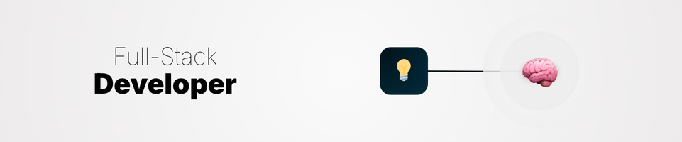

  <h1 align="center">I'm Kaio.</h1>
  <h3 align="center">Developer and Entrepreneur.</h3>  

- ~~🎓 BS in Computer Science.~~ - I dropped out of college, made $17k in first month and raised over $300k in funding.
- 🎯 Merging code and narrative to build products that connect.
- 💻 Full-Stack developer since 2021.
- ⚛️ Typescript | React | NodeJS
- 📫 Reach me: [LinkedIn](https://www.linkedin.com/in/kaiolucas/)  

<h3 align="center">I've played with:</h3>  

 
  
  
  
  
  
  
  
  
  
  
  
  
  
  
          
  
  
  
  
  
  
  
  
  
  
  
  
  
  
  
  
  
  
  
  

 
